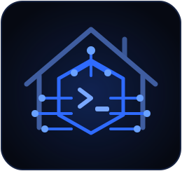
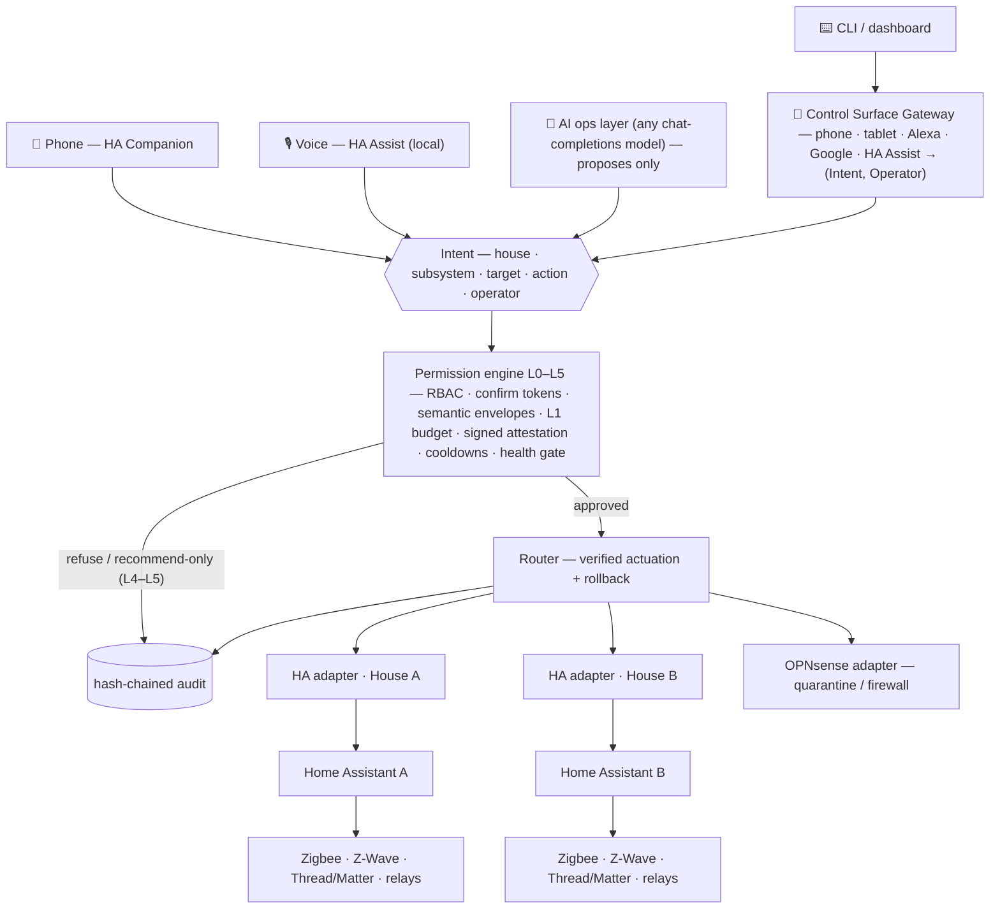

<div align="center">



# HouseCommand · `homeops`

**A two-house AI operations layer that treats the home as critical infrastructure.**

*The AI proposes. A deterministic, fail-closed permission engine disposes.*


[**DESIGN.md**](DESIGN.md) · [**Strategy**](docs/STRATEGY.md) · [**Productization**](docs/PRODUCTIZATION.md) · [**housecommand.manticthink.com**](https://housecommand.manticthink.com)

</div>

---

## Why this exists

A serious residential **AI ops layer** — not a consumer smart-home kit — for two adjacent
properties (**House A**, **House B**) sharing one operations plane. It monitors, coordinates,
and controls power, backup/solar/generator, lighting, HVAC, water, locks/access, garage/gates,
cameras, perimeter and life-safety sensors, network/cybersecurity, appliances, intercoms, and
occupancy — under a graduated permission model that keeps dangerous actions behind hardware,
confirmation, and human approval. Capability first, but on three non-negotiables:
**local-first reliability**, **human override on every system**, **strong network segmentation**.

## The whole system in one diagram

Every surface — a phone tap, a voice command, the CLI, or the Claude ops layer — collapses into
the same structured intent and faces the same engine. No surface is privileged; the AI least of all.



Below all of it sits the invariant that software never gets the last word: **every physical
switch, key, valve, breaker, and thermostat always works**, and a per-house **AI hold** suspends
AI actuation while local automations keep running.

## Core principles

| Principle | Meaning |
|---|---|
| **Local-first** | Every critical automation runs on-premises (Home Assistant + Node-RED), no cloud, no internet. The AI *augments* the house; it is never a dependency. |
| **Human override everywhere** | Physical controls always work; "AI hold" per house; manual overrides are audited, never blocked. |
| **Segmented & hardened** | VLANs for trusted / IoT / cameras / servers / guest / automation; WireGuard-only remote access; MFA; no default creds, no exposed management ports. |
| **Two-house separation** | Independent cores, networks, identities, logs. Every command resolves to exactly one house; cross-house or high-impact actions require explicit confirmation. |
| **Safe high-power integration** | Panels, breakers, generator, solar, battery, ATS, egress hardware: professionally installed and inspected. The AI never bypasses a code-required safety system. |
| **Bring any model** | The reasoning layer is a plug; the engine is the socket. Any chat-completions endpoint — Claude, GPT, or a local Ollama/vLLM model on-prem — faces the same gated tools. Swapping the model changes *capability*, never *authority*. |

## The permission ladder

The level is a property of the **action**, enforced server-side — the AI cannot self-escalate.

| | Level | AI capability |
|---|---|---|
| 🟢 | **L0 · Observe** | read all sensors, cameras, meters, logs, network, power, water, environment |
| 🟢 | **L1 · Routine** | direct: lights, thermostats (in range), fans, blinds, speakers, non-critical plugs, scenes, notifications |
| 🟡 | **L2 · Security/Utility** | conditioned/confirmed: locks, arm/disarm, garage, exterior lights, water shutoff, irrigation, IoT quarantine, camera modes, alarm escalation |
| 🟠 | **L3 · Power/Infra** | approved HW + human confirmation for every action; emergency/local-automation responses are exempt: smart panel/breakers, load-shed, generator start, battery modes, EV limits, HVAC emergency shutoff, whole-house water main, firewall policy |
| 🔴 | **L4 · Recommend only** | main breaker, utility side, permanent firewall restructure, life-safety changes, unlocking for unknown persons — **notify a human, no auto-execute** |
| ⛔ | **L5 · Prohibited** | bypass electrical safety, disable smoke/CO, meter tampering, illegal lock defeat, disable emergency systems, interfere with responders |

**L4/L5 have no execution path exposed to the AI** — only a recommend/notify path exists in the code.

## Quickstart — a full estate in software, thirty seconds

Both houses are simulated in-process (no hardware, no HA, no network), so the entire
architecture and permission model can be validated before a single device is bought.

```bash
pip install -r requirements.txt        # PyYAML + pytest (anthropic only for the live test)
pytest -q                              # 296 offline tests: permissions, router, automations,
                                       #   fail-safe, local-first, AI-ops, audit, health, RBAC,
                                       #   portfolio, exporters, dashboard, service, preflight
python scripts/run_scenario.py all    # leak / grid-loss / fire-CO / intrusion / rogue-device
python scripts/demo.py                # end-to-end: cross-house guard, WAN-down local-first, L4 refusal
python -m homeops.cli status          # both houses at a glance
homeops chat --ollama qwen3:14b       # resident chat through ANY model you choose:
homeops chat --model gpt-5.1          #   --ollama M · --model M · --provider P · --base-url URL,
homeops chat --base-url https://openrouter.ai/api/v1 --model deepseek/deepseek-chat
                                      #   or HOMEOPS_AI_* env, or an ANTHROPIC/OPENAI key;
                                      #   nothing configured -> deterministic fallback (still gated + audited)
```

After `pip install -e .`, `homeops` is a console command (`homeops status`, `homeops chat …`),
the developer's entry point: pick the reasoning layer with a flag or `HOMEOPS_AI_*` env and drive
the estate from a terminal — no vendor SDK needed for local/OpenAI-compatible endpoints.

The ops layer (`homeops/ai/`) is **model-agnostic**: a neutral transcript is translated to any
vendor wire format by a `Provider`, so Claude (native), GPT, or any OpenAI-compatible endpoint
(OpenRouter, DeepSeek, Groq, vLLM, LM Studio, or a local **Ollama** model that keeps the whole
loop on-prem) proposes through the same gated, audited tools. The endpoint is untrusted by
construction — it can only *propose*. If the API/internet is unavailable, or a house is on AI
hold, it degrades to a deterministic fallback — **the house is never in the AI's hands for
safety**.

### Bring any model

The model is an installer choice, set in the deployment descriptor — not a code change:

```yaml
ai:
  provider: openai-compatible          # anthropic · openai · openai-compatible · none
  model: qwen3:14b                      # required for openai-compatible
  base_url: http://127.0.0.1:11434/v1   # Ollama on-prem → the whole loop stays local
  l1_daily_budget: 60                   # cap on AI-originated L1 actuations/house/day
  # A non-loopback endpoint MUST be https — the estate snapshot travels in every request;
  # allow_insecure: true is the explicit, linted exception for a trusted VLAN.
```

`validate` lints this statically (unknown provider, missing model, plaintext non-loopback
transport, bad budget all fail closed) before anything touches a house. The security claim is
independent of *which* model you choose: a hostile endpoint changes what is *proposed*, never
what *occurs*.

## Operating it for real

The ops lifecycle is three fail-closed steps — each refuses loudly rather than degrading silently:

```text
validate ──▶ preflight ──▶ serve
offline lint   read-only live    systemd daemon; read-only,
(exit 1 on     commissioning     token-gated HTTP surface
 any fail)     (GET-only, never  (/ , /healthz); no write
               actuates)         path exists on the network
```

```bash
python -m homeops.cli validate  deploy/deployment.example.yaml
python -m homeops.cli preflight /etc/homeops/deployment.yaml
python -m homeops.cli serve     /etc/homeops/deployment.yaml    # or: deploy/install.sh + systemd
```

Secrets never live in config: they come from the environment or a **0600-enforced** secrets file
(`homeops/secrets.py` refuses to start on a group/other-readable file). A non-loopback dashboard
bind without a bearer token is a startup refusal. See [`deploy/`](deploy/) for the hardened
systemd unit and installer.

### Driving real hardware

The same engine, automations, and AI run unchanged against live **Home Assistant** (REST commands,
WebSocket events) and **OPNsense** (REST) — only the adapter changes:

```python
from homeops import build_real_world, start_event_bridge

world = build_real_world(
    ha_base_url="http://homeassistant.local:8123", ha_token="<HA long-lived token>",
    opn_base_url="https://opnsense.local", opn_key="<key>", opn_secret="<secret>",
    entity_map={"house_a.lock.front_door": "lock.front_door"},   # homeops id -> real HA entity
    event_map={"binary_sensor.leak_kitchen": {"type": "leak", "when": "on",
                                              "house_id": "house_a", "data": {"flow": 45}}},
)
start_event_bridge(world)   # HA state_changed -> the same local-first automations
```

- [`adapters/homeassistant.py`](homeops/adapters/homeassistant.py) — intent → HA `domain.service`,
  prior-state rollback for the reversible subset, `state_changed` bridge. Stdlib-only commands.
- [`adapters/opnsense.py`](homeops/adapters/opnsense.py) — IoT quarantine (firewall alias +
  reconfigure) and firewall policy.
- [`adapters/composite.py`](homeops/adapters/composite.py) — `network` → OPNsense, everything else → HA.

Both are unit-tested offline against fake transports — the suite needs no live services.

## What the engine guarantees

Adversarially reviewed (by a different LLM), iterated across review findings R-1–R-3, and
stress-tested against a deliberately **hostile model**. Every row has a regression test in
[`tests/test_hardening.py`](tests/test_hardening.py), [`test_redteam.py`](tests/test_redteam.py),
[`test_any_model.py`](tests/test_any_model.py), and
[`test_nuisance_and_attestation.py`](tests/test_nuisance_and_attestation.py).

| Threat | Defense |
|---|---|
| AI self-confirms a cross-house action | `confirm_cross_house` removed from the AI tool surface — a human must confirm |
| Confirmation token replayed | tokens are unguessable, single-use, TTL-bounded, and bound to the **full intent + operator** |
| Chat coaxes the model into confirming | tokens flow engine → resident → engine; tests assert issued tokens **never appear in the model's context** |
| Model swapped for a different vendor | authority is model-invariant: any chat-completions endpoint (Claude · GPT · local Ollama/vLLM) translates wire formats only and faces the same engine, tools, and absent token |
| Any surface (phone · tablet · Alexa · Google · HA Assist) tries to gate its own permissions | it cannot: the **Control Surface Gateway** is a pure translation to (Intent, Operator); the router is the sole authority, so the per-surface policy is a *consequence* of each device's role cap, never a second enforcement path that can drift ([`test_gateway.py`](tests/test_gateway.py)) |
| A **hostile** model smuggles authority, proposes L5, and lies about it | capability varies, authority does not: forged `confirm_token`/`emergency`/cross-house fields are dropped by construction, L4/L5 have no path, zero actuation, and the audit chain contradicts the model's prose ([`test_any_model.py`](tests/test_any_model.py)) |
| Spoofed leak event closes the main | two-signal rule re-reads **both** independent channels (wet sensor AND abnormal flow) at actuation time |
| Rollback raced by a pending transition | rollback cancels in-flight physical transitions |
| Rollback used as an unguarded side door | rollback is gated at the authority of the **inverse verb** — operator required, RBAC/guest/role caps apply, AI barred from L2+, confirm-required inverses refused, safety-critical inverses health-gated, tokens single-use |
| HTTP 200 treated as physical truth | safety-impacting actions are **verified by read-back**; unverified outcomes are recorded as such |
| Dead device silently "commanded" | health gate refuses safety-critical actuation on offline/stale devices |
| AI fallback escalates | the fallback runs as an AI-limited operator, never silently as `owner` |
| Stray action maps to a dangerous service | adapter mappings are **fail-closed** (`unlock_unknown` can never become `lock.unlock`) |
| Out-of-envelope argument (a 200 °F setpoint) | **semantic invariants** in the engine escalate to human confirmation — adapter-independent; the simulator's clamp is no longer the last line |
| Standing consent abused | **delegation certificates** are bounded to explicit delegable actions (L1/L2 plus reversible L3 power/infra only), windowed, budgeted, revocable; safety-critical/destructive actions and L4/L5 remain non-delegable; envelopes outrank them; tokens still never enter model context; `grant()` checks the **grantor's** authority, not just the action's |
| Model spams envelope-legal L1 actions all night | an **AI L1 nuisance budget** caps AI-originated L1 actuation per house per day; humans and emergency automations are exempt |
| Model lies about what a pending action does, to farm a rubber-stamp | every `confirm_required` carries an **engine-signed attestation** (HMAC, key outside model context) rendering the true deed; `confirm()` refuses any signature mismatch — consent attaches to the deed, not its narration |
| Houses collapse onto shared devices | `strict_entity_map` fails startup if any controllable entity lacks an explicit mapping; the validator also rejects duplicate targets |
| Python process dies with the safety logic | `homeops/exporters/` emits the life-safety subset (leak, fire/CO, freeze) as **native HA automations** — the Python layer is the coordination tier, never the last line of defense |

## Module map

| Path | Purpose |
|---|---|
| `homeops/permissions.py` | the L0–L5 model: action levels, confirm tokens, cooldowns, semantic (argument) invariants, AI L1 nuisance budget, signed attestations |
| `homeops/delegations.py` | standing-consent certificates + `try_delegated_execute` (engine-side confirm dance) |
| `homeops/router.py` | resolution pipeline, verified actuation, rollback tokens |
| `homeops/automations.py` | local-first automations (run below the AI) |
| `homeops/audit.py` | tamper-evident hash-chained audit, JSONL persistence, `verify_chain()` |
| `homeops/health.py` · `identity.py` | device heartbeat gate · RBAC principals/roles/scopes |
| `homeops/gateway/` | **Control Surface Gateway** — one authenticated write path; device auth, pending registry w/ attestation, cross-surface confirm; router stays sole authority |
| `homeops/ai/` | model-agnostic ops layer (`providers.py`: Claude native · GPT SDK · any OpenAI-compatible/Ollama endpoint over stdlib HTTP): operational charter, gated tools, stateful resident chat with attestation surfacing (`session.py`), deterministic fallback |
| `homeops/adapters/` | sim, Home Assistant, OPNsense, composite, per-property |
| `homeops/simulator/` | both houses in software: devices, network, scenarios |
| `homeops/baseline.py` | vigilance tier: robust per-entity hour-of-week baselines (median/MAD) -> advisory `anomaly` events; spike-proof, never actuates |
| `homeops/energy.py` | economics tier: deterministic day-ahead battery/EV planner (never-worse guarantee); emits L3-gated *proposed* intents |
| `homeops/portfolio.py` · `dashboard.py` | N-property control plane · HTML oversight view |
| `homeops/exporters/` | native HA life-safety automation YAML |
| `homeops/service.py` · `deployment.py` · `secrets.py` · `preflight.py` | runtime daemon · descriptor + offline lint · fail-closed secrets · read-only commissioning |
| `config/` · `deploy/` · `docs/` | house schema + portfolio examples · systemd/installer · strategy & productization |

## Status — the honest ladder

```text
reference implementation      ✓  complete, 296 tests
pilot-ready software          ✓  audit chain · verified actuation · RBAC ·
                                 semantic envelopes · delegation certs ·
                                 authority-gated rollback · any-model plug ·
                                 L1 nuisance budget · signed attestations ·
                                 control-surface gateway (phone/tablet/voice) ·
                                 N-property plane · HA life-safety export ·
                                 dashboard · runtime service · secrets ·
                                 preflight commissioning
supervised real-house pilot   ◐  software side complete; actuation trials
                                 require a human at each device
production                    ✗  requires the real world (below)
```

> [!IMPORTANT]
> This is a reference implementation and pilot-hardening scaffold. Real deployment still
> requires an **independent security review** of the actuation plane, **verified fail-safe on
> real heterogeneous hardware**, **licensed-professional installation**, and a
> **liability/insurance structure**. Full analysis: [`docs/STRATEGY.md`](docs/STRATEGY.md) ·
> [`docs/PRODUCTIZATION.md`](docs/PRODUCTIZATION.md).

## Reference stack (local-first)

Home Assistant OS cores (primary + cold spare per house) · Mosquitto MQTT · Zigbee2MQTT ·
Z-Wave JS · Thread/Matter border router · Node-RED · OPNsense/UniFi firewall with VLANs +
Suricata IDS/IPS · Frigate NVR + edge-TPU on an isolated camera VLAN · smart panel
(Span/Lumin) or smart breakers · Powerwall/FranklinWH battery · solar + generator + ATS ·
motorized water main + flow/pressure + leak mesh · Z-Wave/Matter locks + monitored alarm
panel · UPS + NAS (ZFS) · WireGuard remote access.

> [!WARNING]
> **Scope note.** This is an architecture and configuration blueprint. Electrical, generator,
> solar/battery, gas, plumbing, egress, and life-safety work must be performed by licensed
> professionals to local code and inspected. The design defers to code and keeps every
> life-safety system independent of the AI.

---

## License

**Copyright © 2026 Colton Williams. Licensed under the [Apache License 2.0](LICENSE).**

Open source. You may use, modify, and distribute this software — including commercially —
under the terms of Apache-2.0, which adds an explicit patent grant and requires preservation
of the [`NOTICE`](NOTICE). This is a *reference implementation*: the license grants rights to
the code, not a warranty of fitness. Real deployment against physical systems still requires the
independent review, professional installation, and liability structure described below and in
[`docs/STRATEGY.md`](docs/STRATEGY.md) — the durable moat was never the source, so the source is open.

---

<div align="center">
<sub><code>&gt;_</code> &nbsp;HouseCommand — command your home like critical infrastructure.</sub>
</div>
