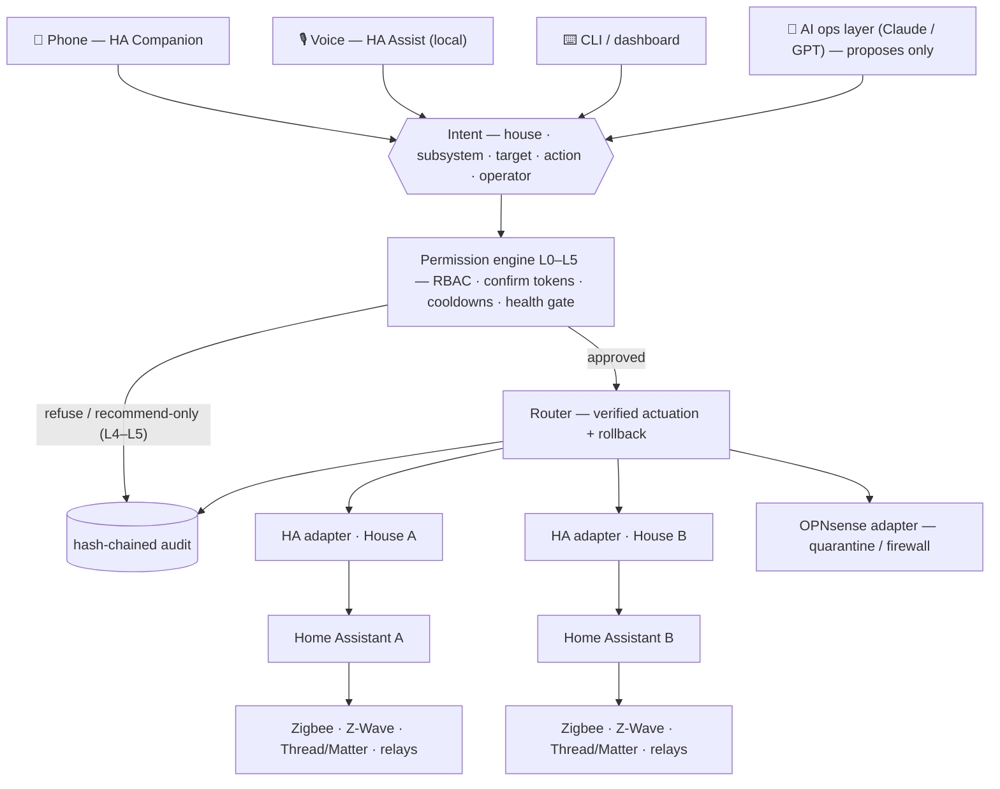

<div align="center">


# HouseCommand · `homeops`

**A two-house AI operations layer that treats the home as critical infrastructure.**

*The AI proposes. A deterministic, fail-closed permission engine disposes.*


[**DESIGN.md**](DESIGN.md) · [**Strategy**](docs/STRATEGY.md) · [**Productization**](docs/PRODUCTIZATION.md) · [**housecommand.manticthink.com**](https://housecommand.manticthink.com)

</div>

---

## Why this exists

A serious residential **AI ops layer** — not a consumer smart-home kit — for two adjacent
properties (**House A**, **House B**) sharing one operations plane. It monitors, coordinates,
and controls power, backup/solar/generator, lighting, HVAC, water, locks/access, garage/gates,
cameras, perimeter and life-safety sensors, network/cybersecurity, appliances, intercoms, and
occupancy — under a graduated permission model that keeps dangerous actions behind hardware,
confirmation, and human approval. Capability first, but on three non-negotiables:
**local-first reliability**, **human override on every system**, **strong network segmentation**.

## The whole system in one diagram

Every surface — a phone tap, a voice command, the CLI, or the Claude ops layer — collapses into
the same structured intent and faces the same engine. No surface is privileged; the AI least of all.



Below all of it sits the invariant that software never gets the last word: **every physical
switch, key, valve, breaker, and thermostat always works**, and a per-house **AI hold** suspends
AI actuation while local automations keep running.

## Core principles

| Principle | Meaning |
|---|---|
| **Local-first** | Every critical automation runs on-premises (Home Assistant + Node-RED), no cloud, no internet. The AI *augments* the house; it is never a dependency. |
| **Human override everywhere** | Physical controls always work; "AI hold" per house; manual overrides are audited, never blocked. |
| **Segmented & hardened** | VLANs for trusted / IoT / cameras / servers / guest / automation; WireGuard-only remote access; MFA; no default creds, no exposed management ports. |
| **Two-house separation** | Independent cores, networks, identities, logs. Every command resolves to exactly one house; cross-house or high-impact actions require explicit confirmation. |
| **Safe high-power integration** | Panels, breakers, generator, solar, battery, ATS, egress hardware: professionally installed and inspected. The AI never bypasses a code-required safety system. |

## The permission ladder

The level is a property of the **action**, enforced server-side — the AI cannot self-escalate.

| | Level | AI capability |
|---|---|---|
| 🟢 | **L0 · Observe** | read all sensors, cameras, meters, logs, network, power, water, environment |
| 🟢 | **L1 · Routine** | direct: lights, thermostats (in range), fans, blinds, speakers, non-critical plugs, scenes, notifications |
| 🟡 | **L2 · Security/Utility** | conditioned/confirmed: locks, arm/disarm, garage, exterior lights, water shutoff, irrigation, IoT quarantine, camera modes, alarm escalation |
| 🟠 | **L3 · Power/Infra** | approved HW + confirm: smart panel/breakers, load-shed, generator start, battery modes, EV limits, HVAC emergency shutoff, whole-house water main, firewall policy |
| 🔴 | **L4 · Recommend only** | main breaker, utility side, permanent firewall restructure, life-safety changes, unlocking for unknown persons — **notify a human, no auto-execute** |
| ⛔ | **L5 · Prohibited** | bypass electrical safety, disable smoke/CO, meter tampering, illegal lock defeat, disable emergency systems, interfere with responders |

**L4/L5 have no execution path exposed to the AI** — only a recommend/notify path exists in the code.

## Quickstart — a full estate in software, thirty seconds

Both houses are simulated in-process (no hardware, no HA, no network), so the entire
architecture and permission model can be validated before a single device is bought.

```bash
pip install -r requirements.txt        # PyYAML + pytest (anthropic only for the live test)
pytest -q                              # 119 offline tests: permissions, router, automations,
                                       #   fail-safe, local-first, AI-ops, audit, health, RBAC,
                                       #   portfolio, exporters, dashboard, service, preflight
python scripts/run_scenario.py all    # leak / grid-loss / fire-CO / intrusion / rogue-device
python scripts/demo.py                # end-to-end: cross-house guard, WAN-down local-first, L4 refusal
python -m homeops.cli status          # both houses at a glance
python -m homeops.cli ask             # resident chat: memory, in-dialogue confirm/deny
                                      #   (ANTHROPIC_API_KEY -> Claude, OPENAI_API_KEY -> GPT, neither -> deterministic fallback)
```

The Claude ops layer (`homeops/ai/`, `claude-opus-4-8`, adaptive thinking, cached system prefix)
proposes actions through gated, audited tools; the offline suite drives it with a scripted mock.
If the API or internet is unavailable, or a house is on AI hold, it degrades to a deterministic
fallback — **the house is never in the AI's hands for safety**.

## Operating it for real

The ops lifecycle is three fail-closed steps — each refuses loudly rather than degrading silently:

```text
validate ──▶ preflight ──▶ serve
offline lint   read-only live    systemd daemon; read-only,
(exit 1 on     commissioning     token-gated HTTP surface
 any fail)     (GET-only, never  (/ , /healthz); no write
               actuates)         path exists on the network
```

```bash
python -m homeops.cli validate  deploy/deployment.example.yaml
python -m homeops.cli preflight /etc/homeops/deployment.yaml
python -m homeops.cli serve     /etc/homeops/deployment.yaml    # or: deploy/install.sh + systemd
```

Secrets never live in config: they come from the environment or a **0600-enforced** secrets file
(`homeops/secrets.py` refuses to start on a group/other-readable file). A non-loopback dashboard
bind without a bearer token is a startup refusal. See [`deploy/`](deploy/) for the hardened
systemd unit and installer.

### Driving real hardware

The same engine, automations, and AI run unchanged against live **Home Assistant** (REST commands,
WebSocket events) and **OPNsense** (REST) — only the adapter changes:

```python
from homeops import build_real_world, start_event_bridge

world = build_real_world(
    ha_base_url="http://homeassistant.local:8123", ha_token="<HA long-lived token>",
    opn_base_url="https://opnsense.local", opn_key="<key>", opn_secret="<secret>",
    entity_map={"house_a.lock.front_door": "lock.front_door"},   # homeops id -> real HA entity
    event_map={"binary_sensor.leak_kitchen": {"type": "leak", "when": "on",
                                              "house_id": "house_a", "data": {"flow": 45}}},
)
start_event_bridge(world)   # HA state_changed -> the same local-first automations
```

- [`adapters/homeassistant.py`](homeops/adapters/homeassistant.py) — intent → HA `domain.service`,
  prior-state rollback for the reversible subset, `state_changed` bridge. Stdlib-only commands.
- [`adapters/opnsense.py`](homeops/adapters/opnsense.py) — IoT quarantine (firewall alias +
  reconfigure) and firewall policy.
- [`adapters/composite.py`](homeops/adapters/composite.py) — `network` → OPNsense, everything else → HA.

Both are unit-tested offline against fake transports — the suite needs no live services.

## What the engine guarantees

Adversarially reviewed (by a different LLM) and hardened; every row has a regression test in
[`tests/test_hardening.py`](tests/test_hardening.py) and friends.

| Threat | Defense |
|---|---|
| AI self-confirms a cross-house action | `confirm_cross_house` removed from the AI tool surface — a human must confirm |
| Confirmation token replayed | tokens are unguessable, single-use, TTL-bounded, and bound to the **full intent + operator** |
| Chat coaxes the model into confirming | tokens flow engine → resident → engine; tests assert issued tokens **never appear in the model's context** |
| Model swapped for a different vendor | authority is model-invariant: providers translate wire formats only — Claude and GPT face the same engine, tools, and absent token (proven under both in tests) |
| Spoofed leak event closes the main | two-signal rule re-reads **both** independent channels (wet sensor AND abnormal flow) at actuation time |
| Rollback raced by a pending transition | rollback cancels in-flight physical transitions |
| HTTP 200 treated as physical truth | safety-impacting actions are **verified by read-back**; unverified outcomes are recorded as such |
| Dead device silently "commanded" | health gate refuses safety-critical actuation on offline/stale devices |
| AI fallback escalates | the fallback runs as an AI-limited operator, never silently as `owner` |
| Stray action maps to a dangerous service | adapter mappings are **fail-closed** (`unlock_unknown` can never become `lock.unlock`) |
| Houses collapse onto shared devices | `strict_entity_map` fails startup if any controllable entity lacks an explicit mapping; the validator also rejects duplicate targets |
| Python process dies with the safety logic | `homeops/exporters/` emits the life-safety subset (leak, fire/CO, freeze) as **native HA automations** — the Python layer is the coordination tier, never the last line of defense |

## Module map

| Path | Purpose |
|---|---|
| `homeops/permissions.py` | the L0–L5 model: action levels, confirm tokens, cooldowns |
| `homeops/router.py` | resolution pipeline, verified actuation, rollback tokens |
| `homeops/automations.py` | local-first automations (run below the AI) |
| `homeops/audit.py` | tamper-evident hash-chained audit, JSONL persistence, `verify_chain()` |
| `homeops/health.py` · `identity.py` | device heartbeat gate · RBAC principals/roles/scopes |
| `homeops/ai/` | model-agnostic ops layer (`providers.py`: Claude native, GPT via chat-completions): operational charter, gated tools, stateful resident chat (`session.py`), deterministic fallback |
| `homeops/adapters/` | sim, Home Assistant, OPNsense, composite, per-property |
| `homeops/simulator/` | both houses in software: devices, network, scenarios |
| `homeops/portfolio.py` · `dashboard.py` | N-property control plane · HTML oversight view |
| `homeops/exporters/` | native HA life-safety automation YAML |
| `homeops/service.py` · `deployment.py` · `secrets.py` · `preflight.py` | runtime daemon · descriptor + offline lint · fail-closed secrets · read-only commissioning |
| `config/` · `deploy/` · `docs/` | house schema + portfolio examples · systemd/installer · strategy & productization |

## Status — the honest ladder

```text
reference implementation      ✓  complete, 119 tests
pilot-ready software          ✓  audit chain · verified actuation · RBAC ·
                                 N-property plane · HA life-safety export ·
                                 dashboard · runtime service · secrets ·
                                 preflight commissioning
supervised real-house pilot   ◐  software side complete; actuation trials
                                 require a human at each device
production                    ✗  requires the real world (below)
```

> [!IMPORTANT]
> This is a reference implementation and pilot-hardening scaffold. Real deployment still
> requires an **independent security review** of the actuation plane, **verified fail-safe on
> real heterogeneous hardware**, **licensed-professional installation**, and a
> **liability/insurance structure**. Full analysis: [`docs/STRATEGY.md`](docs/STRATEGY.md) ·
> [`docs/PRODUCTIZATION.md`](docs/PRODUCTIZATION.md).

## Reference stack (local-first)

Home Assistant OS cores (primary + cold spare per house) · Mosquitto MQTT · Zigbee2MQTT ·
Z-Wave JS · Thread/Matter border router · Node-RED · OPNsense/UniFi firewall with VLANs +
Suricata IDS/IPS · Frigate NVR + edge-TPU on an isolated camera VLAN · smart panel
(Span/Lumin) or smart breakers · Powerwall/FranklinWH battery · solar + generator + ATS ·
motorized water main + flow/pressure + leak mesh · Z-Wave/Matter locks + monitored alarm
panel · UPS + NAS (ZFS) · WireGuard remote access.

> [!WARNING]
> **Scope note.** This is an architecture and configuration blueprint. Electrical, generator,
> solar/battery, gas, plumbing, egress, and life-safety work must be performed by licensed
> professionals to local code and inspected. The design defers to code and keeps every
> life-safety system independent of the AI.

---

## License

**Copyright © 2026 Cole-Will-I-Am. All rights reserved.** This is **not** open-source software.
The repository is public for viewing, but no rights are granted: you may not copy, modify,
redistribute, deploy, or use the Work commercially without prior written permission. Public
visibility and reserved rights are orthogonal — absent an explicit grant, copyright's default is
that all rights remain with the author. See [`LICENSE`](LICENSE). Licensing inquiries welcome.

---

<div align="center">
<sub><code>&gt;_</code> &nbsp;HouseCommand — command your home like critical infrastructure.</sub>
</div>
